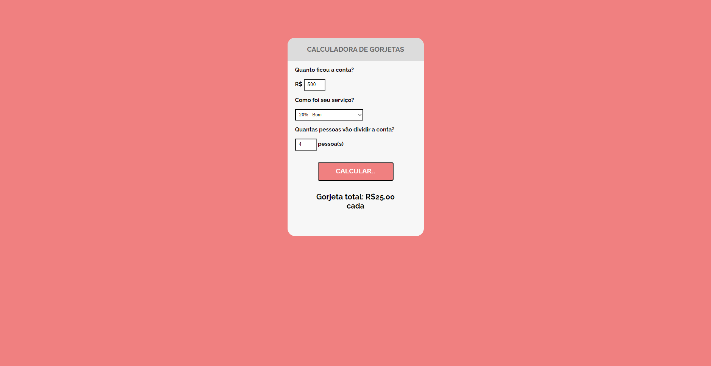

## Calculadora de gorjetas

## Nome do Projeto

    Calculadora de gorjetas

## Sobre o Projeto

    Projeto desenvolvido com HTML, CSS e JavaScript que permite ao usuário calcular o valor da gorjeta a ser paga em uma conta. O usuário pode inserir o valor da conta, dividir ou não entre mais pessoas a conta e escolher a porcentagem da gorjeta desejada. O aplicativo, então, exibe o valor da gorjeta que cada pessoa irá pagar. O design é atrativo e intuitivo, facilitando o uso da ferramenta. Este projeto é uma excelente opção para aqueles que buscam uma solução simples e eficiente para calcular gorjetas.

## Conhecimentos

    . HTML
    . CSS
    . JS

##

